<div align="center">

# 📚 Livraria API

API REST completa desenvolvida com ASP.NET Core, Oracle e RabbitMQ


</div>

---

# 📌 Sobre o projeto

Este projeto consiste em uma API REST com:

- Persistência com Oracle Database
- ORM com Entity Framework Core
- Comunicação assíncrona com RabbitMQ
- Execução de consumers em background

Além disso, foram implementadas:

- Tratamento de erros resiliente
- Separação de responsabilidades
- Uso correto de status HTTP
- Relacionamento entre entidades

# Arquitetura

```bash
├── INSTRUCOES.md
├── LivrariaApi
│   ├── appsettings.Development.json
│   ├── appsettings.json
│   ├── bin
│   ├── Controllers
│   ├── Data
│   ├── LivrariaApi.csproj
│   ├── Messaging
│   ├── Migrations
│   ├── Models
│   ├── obj
│   ├── Program.cs
│   └── Properties
├── LivrariaApiSolution.sln
├── prints
│   ├── CONSUMER-OUTPUT.png
│   ├── DELETE-204-01.png
│   ├── DELETE-204-02.png
│   ├── GET-POR-ID-01.png
│   ├── GET-POR-ID-02.png
│   ├── GET-TODOS-01.png
│   ├── GET-TODOS-02.png
│   ├── OUTPUT-CONSUMER-ATUALIZADO.png
│   ├── OUTPUT-CONSUMER-CRIADO.png
│   ├── OUTPUT-DELETE.png
│   ├── OUTPUT-RABBITMQ-FAILED.png
│   ├── OUTPUT-UPDATE.png
│   ├── POST-201-01.png
│   ├── POST-201-02.png
│   ├── POST-EMPRESTIMOS-01.png
│   ├──  POST-EMPRESTIMOS-02.png
│   ├── PUT-204-alterando-preco-01.png
│   ├── PUT-204-alterando-preco-02.png
│   ├── RABBITMQ-PAINEL.png
│   └── RABBITMQ-PAINEL-SEGUNDA-FILA.png
├── README.md
└── RESPOSTAS.md
```

## Tecnologias
- .NET 9
- Entity Framework Core
- Oracle Database
- RabbitMQ 
- Swagger 
- Docker

# Como rodar
## Clonar o repositório

```bash
git clone https://github.com/ruan-gaspar/dotnet-projetos-2026.git
cd LivrariaApi
```

## Defina a string de conexão Oracle na variável:

```bash
export ConnectionStrings__OracleConnection="User Id=SEU_USUARIO;Password=SUA_SENHA;Data Source=oracle.fiap.com.br:1521/ORCL"
```
## Restaurar e rodar
```bash
dotnet restore
dotnet build
dotnet run
```
API disponível em:

*http://localhost:5097/swagger*


## Subir o RabbitMQ com docker
```bash
docker run -d --name rabbitmq -p 5672:5672 -p 15672:15672 rabbitmq:3-management
```
---
# Funcionalidades
- CRUD de livros
- CRUD de empréstimos de livros com relacionamento
- Integração com Oracle
- Mensageria com RabbitMQ
- Producer e Consumer
- Tratamento de erro com RabbitMQ offline
- Múltiplas filas (criação e atualização)
- Simulação de envio de e-mail no Consumer

---

# Exemplos

## POST 
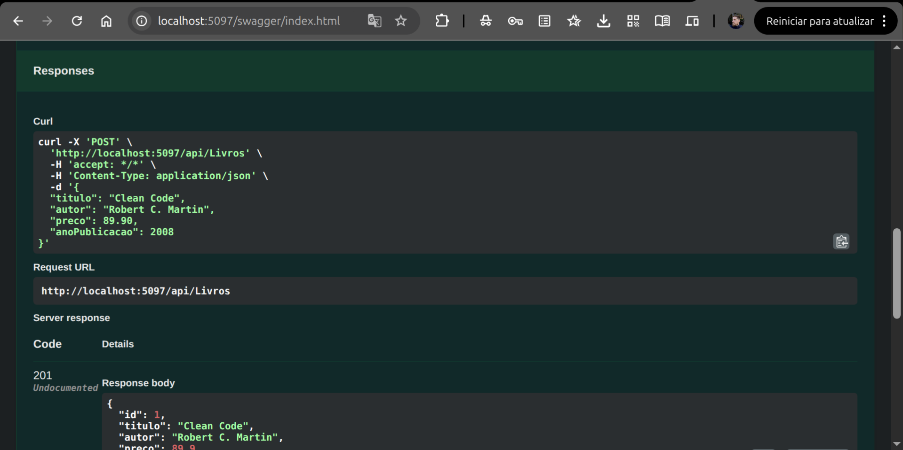
Aqui criamos um novo livro com as informações passadas no objeto json: "titulo", "autor", "preço" e "anoPublicacao"

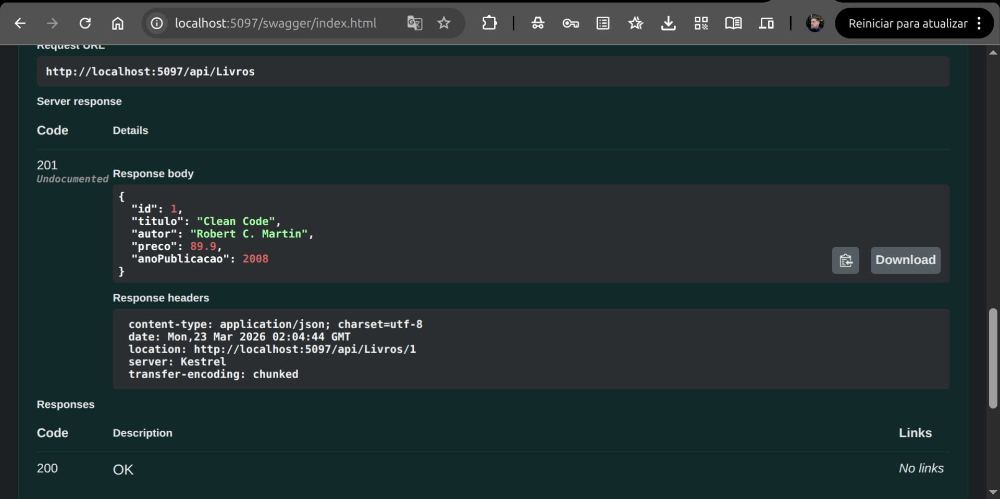
Recebemos status 201 CREATED com um ID gerado (1) seguido das informações do livro criado.


## GET - Todos
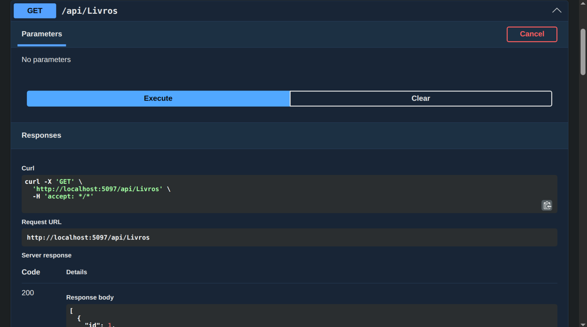
Aqui fazemos uma busca de todos os dados sem nenhum parâmetro. 

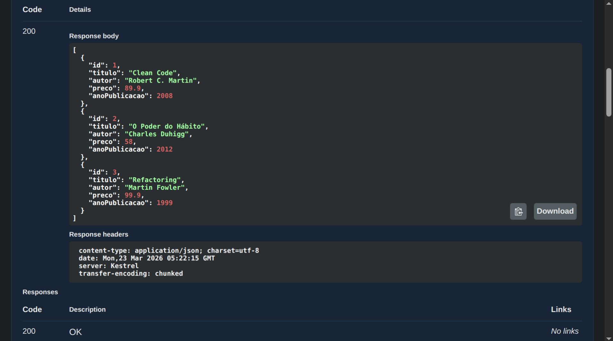
Recebemos 3 livros já criados.

## GET - Id
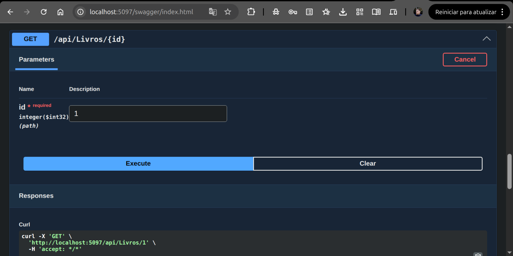
Aqui passamos o ID 1.

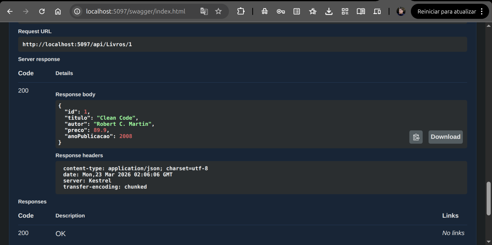
Recebemos o objeto json com as informações do livro.

## PUT 
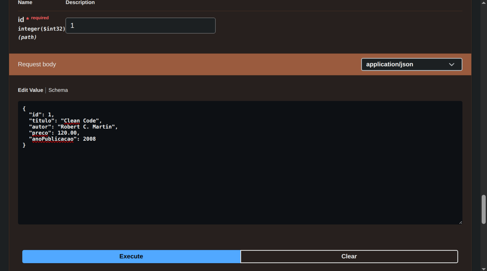
Alteramos o preço de 89.90 para 120.00

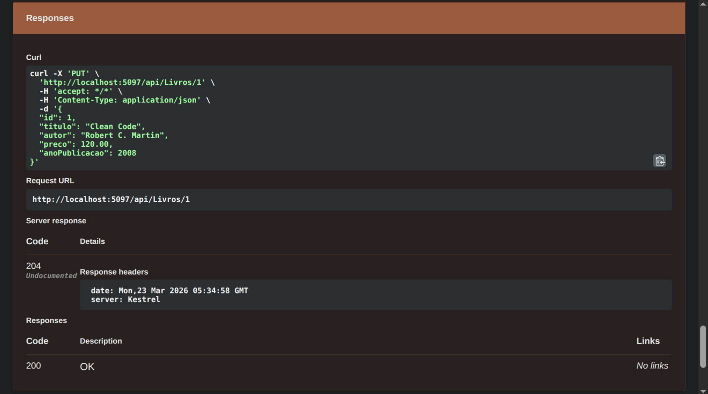
Status 200 Ok, preço alterado.

## DELETE 
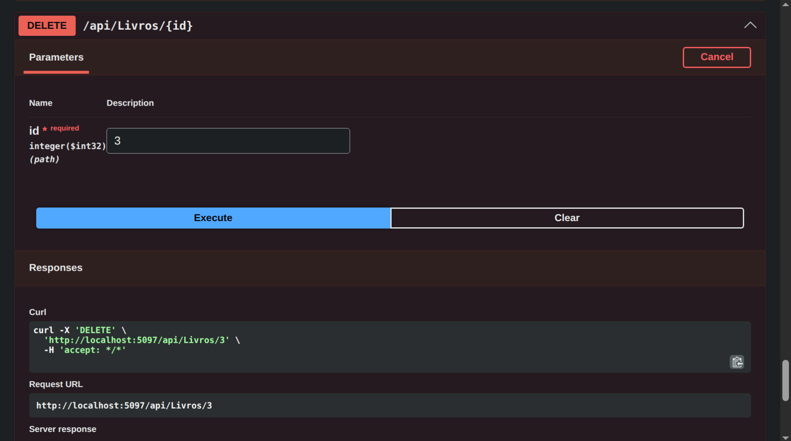
Buscamos ID 3

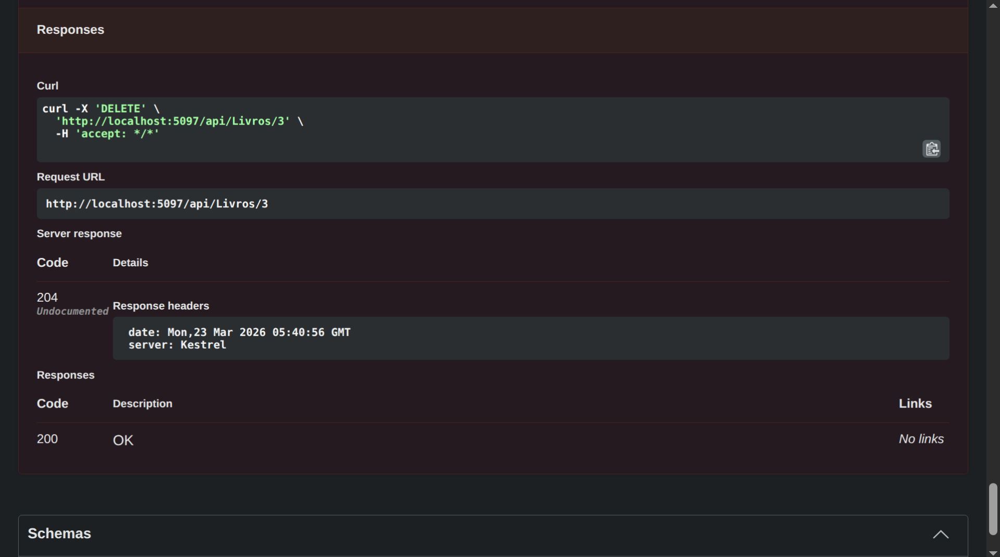
Status 200 Ok, livro deletado.

## POST - Criar empréstimo
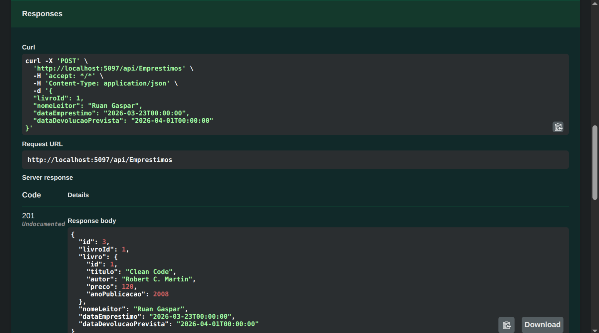
Aqui criamos um empréstimo de livro com novo POST, passando ID e Nome.

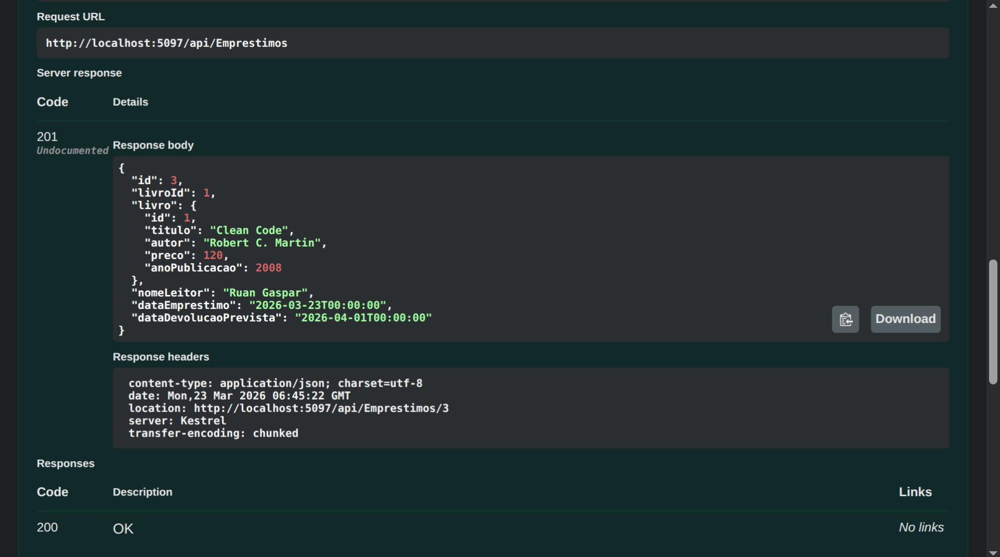
Retorno 

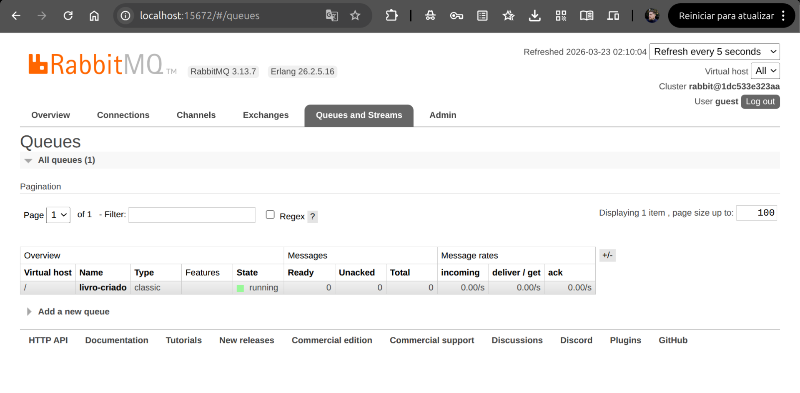
Aqui visualizamos o painel do RabbitMQ com a fila livro-criado.

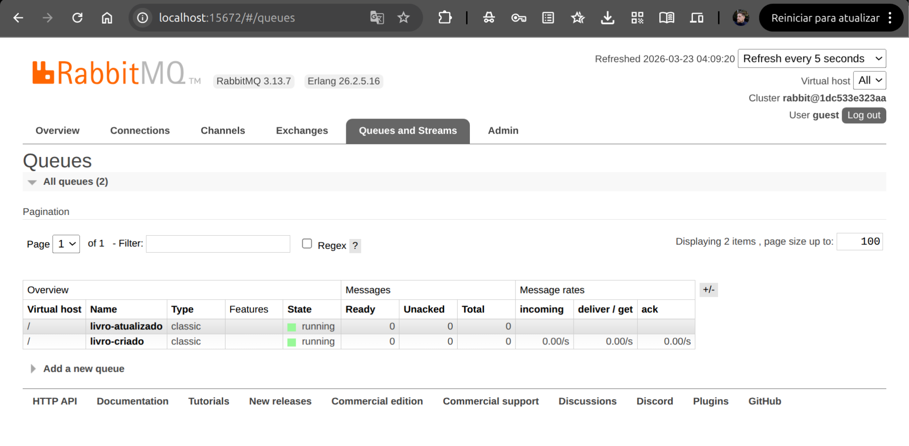
Então criamos uma segunda fila livro-atualizado.

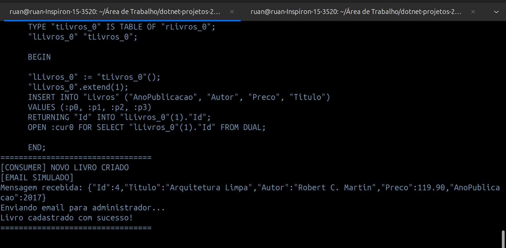
Aqui vemos a implementação de melhoria no log da api, retornando informações de criação visualmente mais agradáveis.

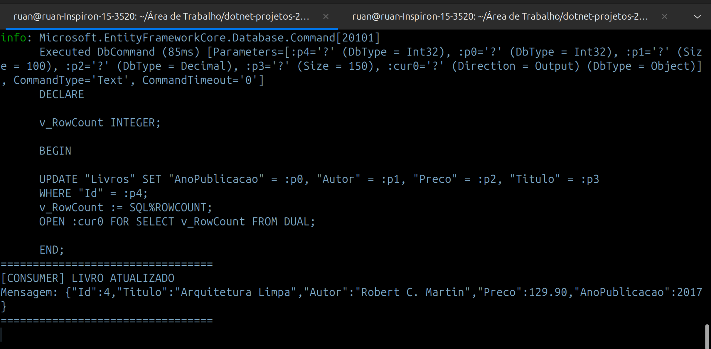
Aqui vemos a mesma implementação para informações de atualização.

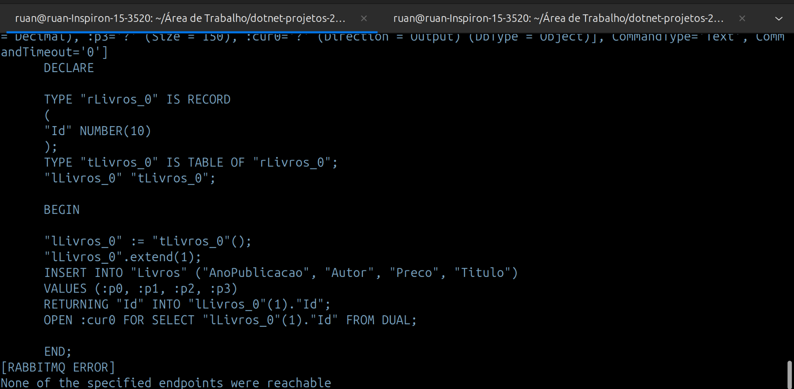
Aqui vemos o teste de resiliência da aplicação, onde a API funciona mesmo sem o RabbitMQ.

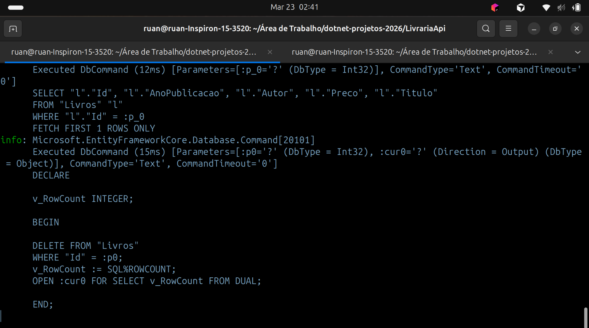
Aqui vemos o DELETE do livro no terminal.

# Considerações Finais

Nesse projeto, pude reforçar conceitos desenvolvidos em aula sobre mensageria com RabbitMQ com uso de Docker, tratamento de erros, sincronicidade e assincronicidade, melhorias visuais de logs do projeto e organização geral.
